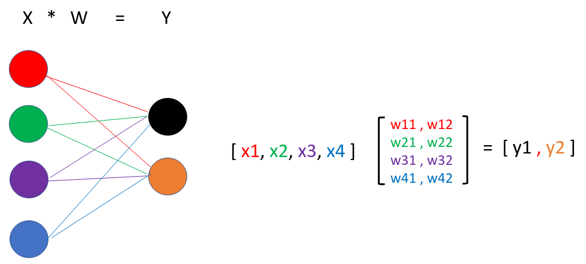

# Ejercicio MultiLayer Perceptron

Escriba un programa llamado **mlp.py**

Defina un método llamada **salida_capa** que reciba dos vectores (listas)

- Vector **x** que representan las salidas de otras neuronas conectadas a ella.
- Matriz **w** que representan los pesos entre las neuronas.

- Utilizando la función de activación **sigmoid** regrese los valores de salida **Y**

